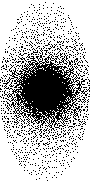

# Subsample: A Python Interface for Poisson Subsampling

<!-- TOC -->
* [Subsample: A Python Interface for Poisson Subsampling](#subsample--a-python-interface-for-poisson-subsampling)
  * [Usage](#usage)
  * [Building and Installation](#building-and-installation)
    * [General Information](#general-information)
    * [Setting up a Virtual Environment](#setting-up-a-virtual-environment)
    * [Using CMake to build the Python package](#using-cmake-to-build-the-python-package)
  * [CS_MoCo_LAB License](#csmocolab-license)
<!-- TOC -->

This repository provides a Python interface for the Poisson subsampling
method available in the [CS_MoCo_LAB repository](https://github.com/thomaskuestner/CS_MoCo_LAB).
So instead of calling a command-line program and writing sampling masks to a text file, you can now directly
call the subsampling function from within Python to get the result mask as a Numpy array.

This project uses a CMake build setup that uses Pybind11 to directly interface with the C++ code.
It can build an installable Python wheel, as well as, directly install the package in a (virtual) Python environment
for you.

## Usage

The core of the interface is a data-class that gives you access to almost all the command-line
arguments available for the Poisson subsampling:

```python
class PoissonSampling:
    width: int = 256
    height: int = 128
    acceleration: float = 2.0
    fully_sampled_fraction: float = 0.065
    espresso_factor: float = 1.0
    espresso_direction: bool = True
    phases: int = 1
    variable_density_type: int = 4
    sample_type: int = 1
    elliptical_mask: bool = True
    power: float = 2.0
    root: float = 2.0
    remove_kspace_center: bool = True
    random_seed: int = 0
    logging: bool = False
```

Therefore, a simple usage of the sampling is done by importing the package, create a `PoissonSampling`
instance, setting all parameters that deviate from the defaults and call the `subsample()` method:

```python
from subsample import PoissonSampling

mask = PoissonSampling(width=10, height=10).subsample()
```

If you have your parameters as a dict because, e.g. you imported it from JSON, then you can do the same
by unpacking the dict.
You only need to take care of correct spelling of the keys.

```python
from subsample import PoissonSampling

my_dict = {"width" : 10, "height": 20}
mask = PoissonSampling(**my_dict).subsample()
```

### Notes

- The `random_seed` property is intended for debugging/development where you need to fix the outcome of the random
  number generator. A value different from zero will be used as an initialization seed.
- The `logging` switch will turn off the debugging `printf` calls coming from the calculation algorithm and which would
  appear in the Python console.

## Helper Programs

Under `apps` there is a small helper program that creates an image for sampling masks.



Use

```shell
maskImage --help
```

to see all options.
The program expects an output directory as last argument.

## Building and Installation

### General Information

Below, I'll only describe how to build the complete Python package.
However, be aware that it actually consists of separate parts that can be build individually
and that the whole project is easy to extend for other language interfaces.
For Python, the rundown is as follows:

1. A shared library is build from the CS_MoCo_LAB C++ sources. These sources were adapted to make
   interfacing easier. In particular, there is now a `PoissonSampling` class that returns a
   `SamplingMask` object whose memory layout is flat so that it's easy to create a Numpy array from it.
2. The Python interface contains Pybind11 C++ code that is compiled, and it uses the built shared
   library underneath. Additionally, it contains Python code necessary for building a Python package.

The Subsample package needs an appropriate Python environment to build, because it uses Python's own 
tools to package the C++ library and Python wrapper code into a Python wheel file.

### Setting up a Virtual Environment

If you already have an existing Python environment (conda, virtualenv) it should have the packages
`setuptools` and `numpy` installed, and it should have Python 3.9 (that's where I tested it).
If you start fresh, I suggest you use [Miniconda](https://docs.conda.io/en/latest/miniconda.html) and
create a new environment based on the definition file you find in 
`interfaces/python/environment.yml`:

```shell
conda env create -f interfaces/python/environment.yml
```

The name of the new environment is `subsample_env` and defined in the `.yml` file.
After that, you can activate and test the new environment by activating it:

```shell
conda activate subsample_env
```

### Using CMake to build the Python package

You'll need CMake >= 3.17 and a suitable C/C++ compiler like gcc or clang installed.
Create a sub-folder `build` inside the project:

```shell
mkdir build
cd build
```

Configure the build by running CMake.
Here it is important to pass two command-line arguments to CMake, where the first one will turn
on building of the Python interface and the second one will specify the location of the Python
environment you want to use.

```shell
cmake -DPYTHON_INT=1 -DPython3_ROOT_DIR="/path/to/subsample_env" ..
```

Now you can build or build and directly install the Python package.
If you have a multicore machine, you can set the `-j XX` option to the number of cores for parallel building.
Otherwise, just leave this option out.
Building the Python wheel:

```shell
make -j 8 PyPackageBuild
```

The installable wheel file can now be found inside your `build` folder under

```shell
interfaces/python/subsample-2022.0-cp39-cp39-linux_x86_64.whl
```

and you can install it in your activated Python environment with

```shell
python -m pip install --upgrade --force-reinstall --no-deps subsample-2022.0-cp39-cp39-linux_x86_64.whl
```

However, if you just want to install the package into the virtual environment you used for building,
you can use

```shell
make -j 8 PyPackageInstall 
```

## CS_MoCo_LAB License

Copyright (c) 2015, thomaskuestner
All rights reserved.
Created by Thomas Kuestner, Christian Wuerslin, Martin Schwartz, Marc Fischer
and others. Institute of Signal Processing and System Theory, University of Stuttgart,
Stuttgart, Germany and Department of Radiology, University Hospital Tübingen, Tübingen,
Germany.

Redistribution and use in source and binary forms, with or without
modification, are permitted provided that the following conditions are met:

* Redistributions of source code must retain the above copyright notice, this
  list of conditions and the following disclaimer.

* Redistributions in binary form must reproduce the above copyright notice,
  this list of conditions and the following disclaimer in the documentation
  and/or other materials provided with the distribution.

THIS SOFTWARE IS PROVIDED BY THE COPYRIGHT HOLDERS AND CONTRIBUTORS "AS IS"
AND ANY EXPRESS OR IMPLIED WARRANTIES, INCLUDING, BUT NOT LIMITED TO, THE
IMPLIED WARRANTIES OF MERCHANTABILITY AND FITNESS FOR A PARTICULAR PURPOSE ARE
DISCLAIMED. IN NO EVENT SHALL THE COPYRIGHT HOLDER OR CONTRIBUTORS BE LIABLE
FOR ANY DIRECT, INDIRECT, INCIDENTAL, SPECIAL, EXEMPLARY, OR CONSEQUENTIAL
DAMAGES (INCLUDING, BUT NOT LIMITED TO, PROCUREMENT OF SUBSTITUTE GOODS OR
SERVICES; LOSS OF USE, DATA, OR PROFITS; OR BUSINESS INTERRUPTION) HOWEVER
CAUSED AND ON ANY THEORY OF LIABILITY, WHETHER IN CONTRACT, STRICT LIABILITY,
OR TORT (INCLUDING NEGLIGENCE OR OTHERWISE) ARISING IN ANY WAY OUT OF THE USE
OF THIS SOFTWARE, EVEN IF ADVISED OF THE POSSIBILITY OF SUCH DAMAGE.

